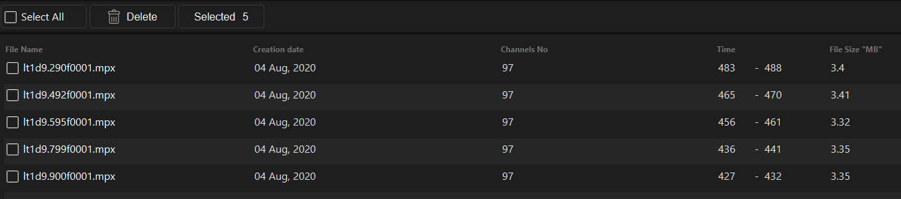
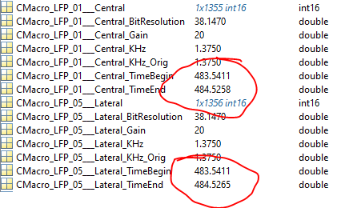

# Pipeline of analysis
This is a overview of analysis steps for a first overview

## Steps
1. [ ] Convert lfp raw data to MatLab format
  - Problem with conversion here. Only 1 seconds of data in MatLab after conversion  
  
  - Example here from lt1d9290f0001_19-01-2021_11-25-05-224.mat  
  
2. [ ] Compute Spectral
3. [ ] Fit FOOOF model

## Versioning
*Version 1.1// 11.11.2020*
